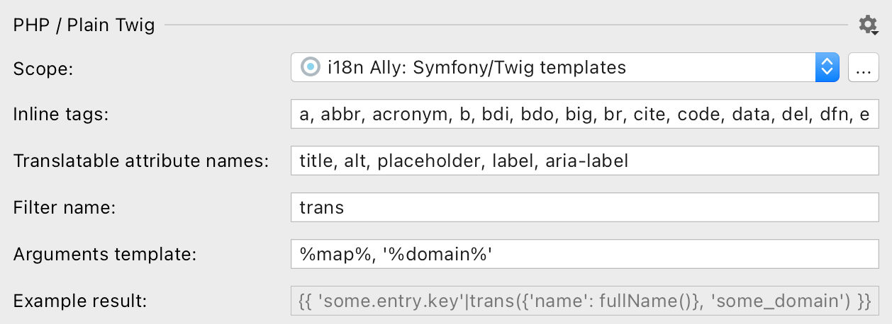
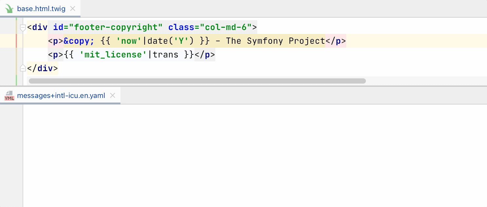

# Twig source configuration

{:width="629px" height="auto"}

## Scope

i18n Ally is applying inspections for files that have `.twig` extension and are included into [a PhpStorm's scope](https://www.jetbrains.com/help/phpstorm/settings-scopes.html#d55e18f7).

Create a new scope or adjust existing by clicking on `…` button and handpicking only the meanigfull directories and files.

Select `Project files` to include all PHP files in your project. Note that for frameworks that has autoconfiguration the relevant scope would be specified automatically.

## Inline tags

TBD

## Translatable attribute names

TBD

## Filter name

TBD

## Arguments template

### `%map%`

Map means an associative array that:

* won't be replaced with anything if there are no placeholders use and the default domain is used: `trans('key')`,
* will be replaced with an empty short syntax array in non-default domain is specified: `trans('key', {}, 'validators')`,
* will be replaced as an associative short syntax array if there are any placeholders detected: `trans('key', {'placeholder': $placeholder})`.

Initial placeholder names are determined automatically based on a respective variable.

### `%domain%`

Domain (could be called a "namespace") usually means a part of language file path from where translations would be searched for. The default domain is usually `messages`, but could be changed by specifying different first domain in [the Symfony language file](/configure-language-files/symfony).

## Supported language constructs

TBD

## Renaming from the editor

If an existing key or automatically captured placeholder is not an optimal one you can rename the right from the editor.

Just put a cursor on a key or a placeholder in source code, then hit `Shift+F6` or right click → hover over `Refactor` → click on `Rename…`:

{:width="744px" height="auto"}

## What's not supported

* Strings inside twig expressions, like ``

## What strings are skipped

* Pure HTML markup with Twig expressions, like `
<b>{{ 'summary'|trans }}</b>
`.
* All attributes except ones listed in "Translatable attribute names" preference.
* Content inside `trans` block as it's assumed to be already extracted.
* Content inside `verbatim` tag.
* Content inside `script` and `pre` tags.
* Strings that looks like code: without letters, multiple words without spaces or `camelCased` ones.

## Deal with branching in two steps

It's commont to have a small simple branches in the Twig templates for presentation purposes:

Webhook <strong>succeededfailed</strong>.


The best practice it to separate this message into two different ones so translators would be a full context and would be able to adjust word order according the the target language grammar.

**1st step:** manually extract the condition out of the message to get two messages without condition


    Webhook <strong>succeeded</strong>.

    Webhook <strong>failed</strong>.



**2nd step:** replace simple messages with i18n Ally


  {{ 'webhook_succeeded'|trans }}

  {{ 'webhook_failed'|trans }}


