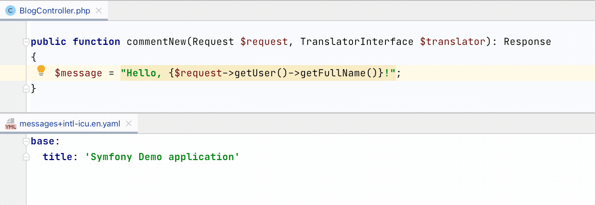

# PHP source configuration

{:width="721px" height="auto"}

## Scope

i18n Ally is applying inspections for files that have `.php` extension and are included into [a PhpStorm's scope](https://www.jetbrains.com/help/phpstorm/settings-scopes.html#d55e18f7).

Create a new scope or adjust existing by clicking on `…` button and handpicking only the meanigfull directories and files.

Select `Project files` to include all PHP files in your project. Note that for frameworks that has autoconfiguration the relevant scope would be specified automatically.

## Function name

It could be any callable PHP structure that wraps arguments into parentheses:

* function: `_(…)`, `__(…)`,
* object method: `$this->trans(…)`, `$translator->trans(…)`,
* static method: `\Yii:app(…)`.

Don't include parentheses there: for example, `gettext(…)` function should be written as `gettext`.

## Arguments template

### `%key%`

Key will be replaced with a string ID that was generated automatically or entered by you during a hardcoded string extraction (note that you have to specify preferred quotes like `'%key%'`).

### `%map%`

Map means an associative array that:

* won't be replaced with anything if there are no placeholders use and the default domain is used: `trans('key')`,
* will be replaced with an empty short syntax array in non-default domain is specified: `trans('key', [], 'validators')`,
* will be replaced as an associative short syntax array if there are any placeholders detected: `trans('key', ['placeholder' => $placeholder])`.

Initial placeholder names are determined automatically based on a respective variable, constant, function, or method.

### `%domain%`

Domain (could be called a "namespace") usually means a part of language file path from where translations would be searched for. The default domain is usually `messages`, but could be changed by specifying different first domain in [the Symfony language file](/configure-language-files/symfony).

## Supported language constructs

i18n Ally finds hardcoded user-facing strings within callable context and supports multiple cases:


"Welcome, John"     // trans('welcome') simple strings
"Welcome, {$name}"  // trans('welcome', ['name' => $name]) interpolated strings
"Welcome, " . $name // trans('welcome', ['name' => $name]) concatenated strings
sprintf("Welcome, %s", $name) // trans('welcome', ['name' => $name]) // sprintf templates


Placeholder names are determined automatically.

## What's not supported

* Non-ICU placeholders, for example: `Hello, %user%!` string with `trans('hello', ['%user%' => $user])`.
* Using natural language as message IDs (common approach for raw gettext, Wordpress or Yii).
* Using an array for message retrieval (common appraoch in PHP legacy codebases, for example `$lang['key']`).
* Adding the default domain to the translation function (in Yii there shuold always be a domain, `\Yii:t('app', 'key')`).

## What strings are skipped

* All arguments passed to functions or methods (except constructors),
* HEREDOC and NOWDOC strings,
* Array keys,
* Class property definitions,
* Default paramenter values,
* Constant name specified in `define` first argument,
* Strings assigned to constants,
* Default argument values
* Full SQL queries and most of SQL parts,
* Strings that looks like code: without letters, multiple words without spaces or `camelCased` ones.

## Renaming from the editor

If an existing key or automatically captured placeholder is not an optimal one you can rename the right from the editor.

Just put a cursor on a key or a placeholder in source code, then hit `Shift+F6` or right click → hover over `Refactor` → click on `Rename…`:

{:width="795px" height="auto"}

## Wire dependencies manually

When extracting a translation you should still wire dependencies manually if they are not global like [Laravel's helper `__(…)`](https://laravel.com/docs/8.x/localization#retrieving-translation-strings) or [static method in Yii 2.0 `\Yii::t(…)`](https://www.yiiframework.com/doc/guide/2.0/en/tutorial-i18n#1-wrap-a-text-message).

Given a Symfony controller with configured autowiring:


class BlogController extends BaseController
{
    public function commentNew(Request $request)
    {
        $message = 'Comment saved!';
    }
}


i18n Ally would help to extract a hardcoded string:


class BlogController extends BaseController
{
    public function commentNew(Request $request)
    {
        $message = $tranlator->translate('comment_saved'); # CHANGED by i18n Ally
    }
}


Then developer should manually specify dependencies:

use Symfony\Contracts\Translation\TranslatorInterface; # CHANGED manually

class BlogController extends BaseController
{
    public function commentNew(Request $request, TranslatorInterface $translator) # CHANGED manually
    {
        $message = $tranlator->translate('Comment saved!');
    }
}

